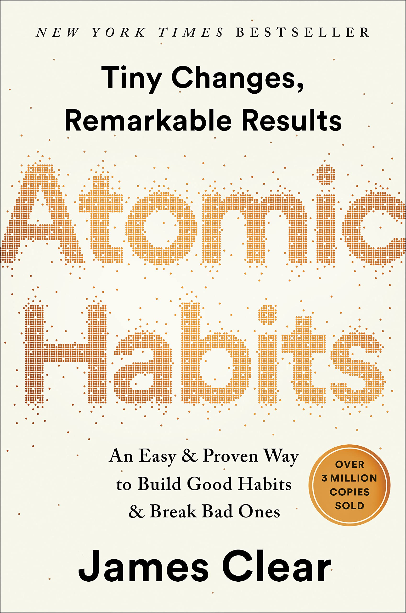

# What is atomic habit?

We can create/remove a habit by first break it down to the smallest analyzable
units. From there we can improve each units to achieve overall improvement.

# Levels that changes can take place:

## Outcome

This is the behaviors/actions that we want to occur. This is the lowest level of
changes. If we focus on this level, there is a lot of mental energy that is
needed.

This is the "what".

## System

This is the way we go about achieving the outcome/actions. The system allows us
to produce the result in a predictable manner. Once we get a system in place,
little mental energy is needed to keep it running/producing the desirable
actions.

This is the "how".

## Identity

This is the person we see ourselves to be. Are we the type of person who runs,
(runner), works out (athlete), plays musical instruments (musician), or draws
(artist)? This is the highest level of change that we can achieve which will
cascade down and produces that system/outcome changes.

This is the "who".

# The four stages of habit

## Cue

This is what signals the habit. For good habits, make this obvious. For bad
habits, make this invisible.

## Craving

This is why we want to do it. For good habits, make this attractive. For bad
habits, make this unattractive.

## Response 

We perform the habit here. For good habits, make this easy. For bad habits, make
this difficult.

## Result

This is the satisfaction we have after performing the action. For good habits,
make this satisfying. For bad habits, make this unsatisfying.

# The four rules of habit changing

## Make it obvious (good habits) / invisible (bad habits)

The cue is usually visual, so if we can't see it, ourr craving won't be
trigger. There are ways to help with forming new habits. They are:

### Intention Implementation

To make sure we will start doing something, we can make it as explicit and
detailed as possible. For example, we can declare the time and place that we
will do something, like "at 3 PM I will workout at the gym". Similarly, we can
select an event as a trigger, as in "after I make my tea, I will meditate".

### Habit Stacking

This method is effective as we can "chain" your existing habits with new ones
to make them stick. For example, I brush my teeth everyday, so I can chain
another habit, such as wipe out the counter, right after. That way, one existing
habit can be the trigger of a new one.
