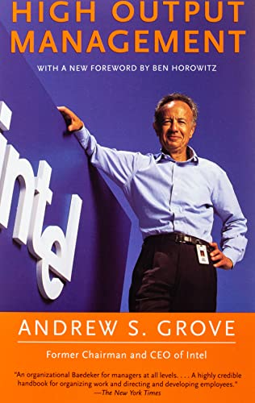

# What is the manager's output?

The manager's output = total output of organizations under his/her
control/influence

A manager needs to be able to leverage his organizations to maximize his output.
To do this, there are 3 ways:
1. Increase the number of activities performed by the manager.
2. Increase the leverage associated with each activity.
3. Shift to the higher leveraged activities.

# What are the main duties of a manager?

Motivate and Train

## Output and productivity of the team

When someone is not getting the job done, there can only be two reasons, that
the employee either can't do the job or is not motivated. This is the key idea
because each reason requires different solutions/approaches. You don't want to
keep training unmotivated employees and/or keep motivating untrained ones.
